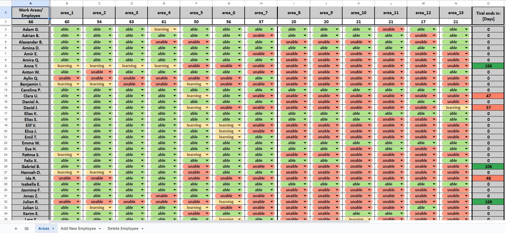
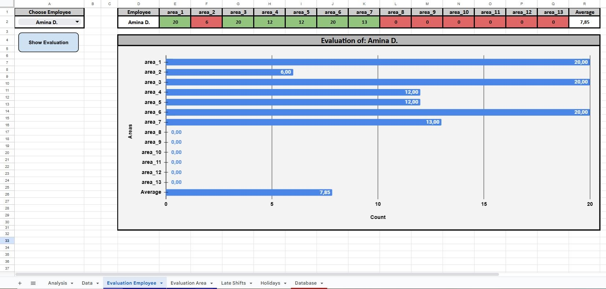

# Workforce Management System

Dieses Repository enthält ein **Workforce Management System**, das auf **Google Sheets** und **Google Apps Script** basiert. Es ermöglicht die Verwaltung und Analyse von Schichtdaten und umfasst mehrere Tabellen, die jeweils eine spezifische Funktionalität bieten. Jede Tabelle ist mit eigenen **Google Apps Script**-Projekt verbunden, das Automatisierungen ermöglicht.

---

## 📁 Projektstruktur

```
├── Work_Areas/
│ ├── Scripts/
│ │   └── [verschiedene Skriptdateien]
│ └── Work Areas.xlsx
├── Analysis/
│ ├── Scripts/
│ │   └── [verschiedene Skriptdateien]
│ └── Analysis.xlsx
├── Scheduling/
│ ├── Scripts/
│ │   └── [verschiedene Skriptdateien]
│ └── Scheduling.xlsx
├── Late_Shifts/
│ ├── Scripts/
│ │   └── [verschiedene Skriptdateien]
│ └── Late Shifts.xlsx
└── README.md
```

---

## 🧑‍💻 Funktionen der Tabellen

### 1. **Work Areas**
- **Beschreibung**: Diese Tabelle verwaltet die verschiedenen Arbeitsbereiche, in denen die Mitarbeitenden arbeiten. Sie zeigt an, welche Mitarbeitenden in den spezifischen Arbeitsbereichen angelernt wurden bzw. angelernt werden.
- **Funktionen**:  
  - Mitarbeiterdatenbank für die Tabellen **Analysis**, **Scheduling** und **Late Shifts**
  - Hinzufügen und Entfernen von Mitarbeitenden
  - Integration von Google Apps Script für die Bereitstellung der Datenbank

### 2. **Analysis**
- **Beschreibung**: Diese Tabelle dient zur Analyse der Schichten. Sie bietet Diagramme und Auswertungen.
- **Funktionen**:
  - Berechnung der "Gesamtstunden" pro Bereich
  - Visualisierung der den Einsatz jedes Mitarbeiters in einem Arbeitsbereich im Vergleich zu seinem Durchschnitt darstellt
  - Visualisierung eines Arbeitsbereiches der anzeigt welcher Mitarbeitende zugewiesen werden sollte
  - Integration von Google Apps Script für die Auswertung von gearbeiteten Spätschichten und Feiertagen

### 3. **Scheduling**
- **Beschreibung**: Diese Tabelle enthält den Schichtplan der Mitarbeitenden und ermöglicht eine einfache Zuordnung von Schichten und Arbeitsbereichen.
- **Funktionen**:
  - Erstellung und Anpassung von Schichtplänen
  - Einteilung der Mitarbeitenden nach ihrem Kenntnisstand
  - Integration von Google Apps Script für die Bereitstellung der Daten für die **Analysis**

### 4. **Late Shifts**
- **Beschreibung**: Diese Tabelle verfolgt und verwaltet Spätschichten.
- **Funktionen**:
  - Darstellung der monatlich und jährlich gearbeiteten Spätschichten pro Mitarbeitenden

---

## ⚙️ Wie man das System verwendet

1. **Google Sheets öffnen**: Sie können jede Tabelle im entsprechenden Ordner öffnen und mit den Daten arbeiten.
2. **Apps Script verwenden**: Gehe zu **Erweiterungen > Apps Script** in Google Sheets, um den entsprechenden Code einzusehen oder zu bearbeiten.
3. **Automatisierungen aktivieren**: Richten Sie Trigger für benutzerdefinierte Apps Script-Funktionen ein.
---

## 🧰 Technologien

- **Google Apps Script (JavaScript-basiert)**
- **Google Sheets API**
- **Excel (.xlsx)** – Exportierte Versionen der Tabellen zur Verwendung außerhalb von Google Sheets

---

## 📷 Vorschau





---

## 🧑‍💻 Autor

[Olaf Kruczek](https://github.com/kruczekolaf)


